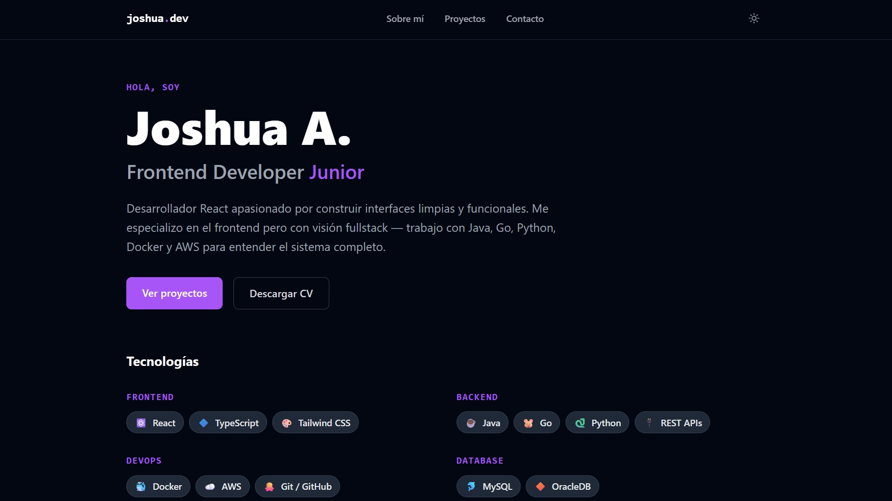

# 🚀 Joshua A. — Portfolio

> Frontend Developer Junior especializado en React & TypeScript, con visión fullstack.


---

## ✨ Vista previa

<!-- Reemplaza con un screenshot real de tu portafolio -->


---

## 📋 Secciones

- **Sobre mí** — presentación, bio y stack tecnológico
- **Proyectos** — proyectos destacados con links a demo y código
- **Contacto** — links a redes

---

## 🛠 Stack

|  Categoría  |    Tecnología   |
|-------------|-----------------|
| Framework   | React 19        |
| Lenguaje    | TypeScript 5.9  |
| Estilos     | Tailwind CSS v3 |
| Bundler     | Vite 8          |
| Formularios | React Hook Form |
| Íconos      | Heroicons       |
| Deploy      | Vercel          |

---

## 🚀 Correr en local

```bash
# Clonar el repositorio
git clone https://github.com/tarttaros/portfolio.git

# Instalar dependencias
npm install

# Levantar servidor de desarrollo
npm run dev
```

Abre [http://localhost:5173](http://localhost:5173) en tu navegador.

---

## ✏️ Agregar proyectos

Edita `src/data/projects.ts`:

```ts
{
  id: 4,
  title: 'Nombre del proyecto',
  description: 'Qué hace y qué problema resuelve.',
  stack: ['React', 'TypeScript', 'Docker'],
  github: 'https://github.com/TU_USUARIO/repo',
  demo: 'https://tu-proyecto.vercel.app',
  image: '/projects/preview.png',
  featured: true,
}
```

Coloca los screenshots en `public/projects/`.

---

## 🌐 Deploy

El proyecto está configurado para deploy automático en Vercel.

```bash
# Build de producción
npm run build

# Verificar tipos
npm run type-check
```

Conecta el repositorio en [vercel.com](https://vercel.com) y cada push a `main` hace deploy automático.

---

## 📄 Licencia

MIT © [Joshua A.](https://github.com/TU_USUARIO)